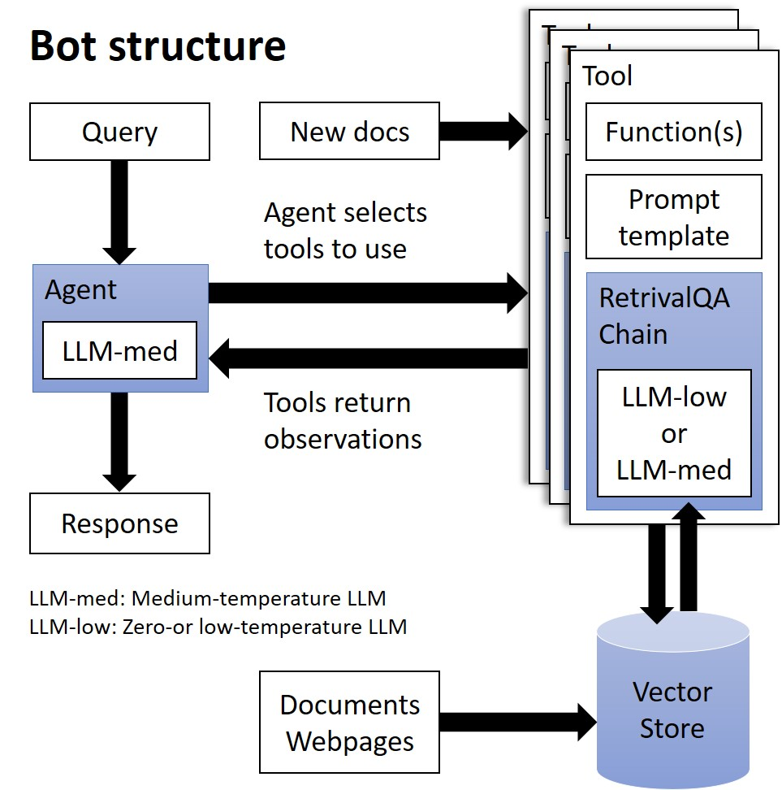

# LLM-powered Slack Chatbot for QA on Documents

*Beep boop!*

These files provide a glimpse into an ongoing AI chatbot project I'm working on, employing large language models (LLMs) with Langchain. Note that this bot is currently in its early development phase, and as such, I genuinely appreciate any suggestions or insights you may have.

This bot is designed to answer questions over documents. If you would like to access the Slack Bot deployed on Slack, please inform me and I will invite you to my Slack Workplace. Since the bot is hosted locally on my computer, please provide the specific time you plan to access the bot so that I can run my development server and connect the bot with Slack.

## Files

- [`bot.py`](/bot.py): The code for deploying the bot as a Slack.

- [`bot_demo.ipynb`](/bot_demo.ipynb): A demo version of the bot for QA on Home Depot products.

Here is the structure of the bot. The logic behind is explained in [`bot_demo.ipynb`](/bot_demo.ipynb).

## Licenses

- Code: MIT license
- Non-code: CC BY-NC-SA 3.0

